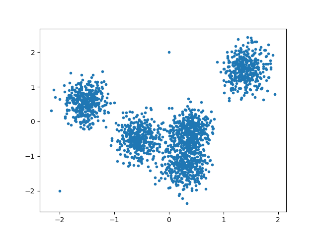
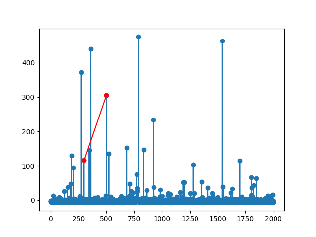
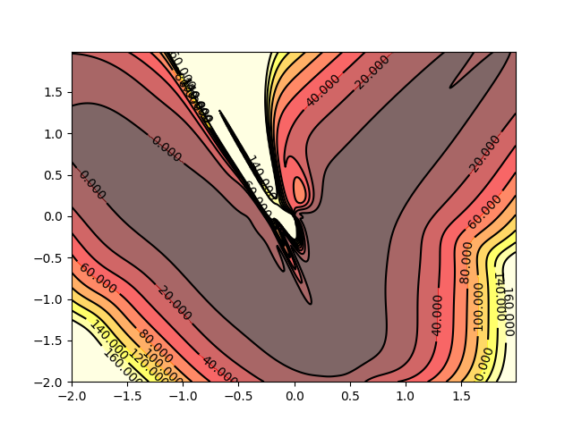

# DAGMM

Tensorflow implement for pather *DEEP AUTOENCODING GAUSSIAN MIXTURE MODEL FOR UNSUPERVISED ANOMALY DETECTION*

这是一个简单的验证，数据集如下图：

其中有两个异常点，经过训练会发现这两个异常点的能量要比其他的点高，如下图

二维空间的能量分布情况如下图所示，可以看出，在训练集周围的的区域能量预测值较低，其他区域的预测值较高。

